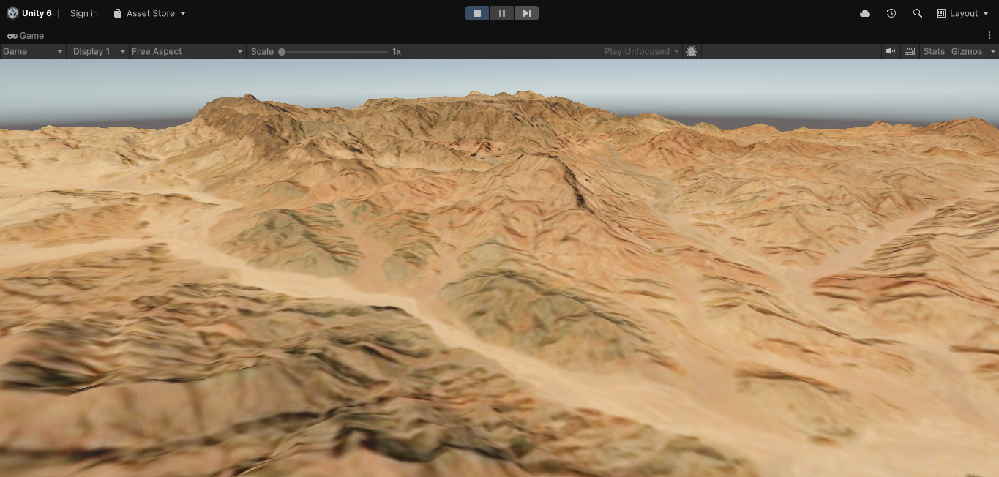

# OpenWorldSDK
An SDK that downloads chunks of the real world map in 3D, including their buildings, based on the longitude, latitude, and the zoom.
> The SDK is currently for Unity Engine only.
# How it works
#### After entering the longitude, latitude, and the zoom:
The SDK downloads the requested chunks's Digital Elevation Model. It saves the downloaded chunks locally, and loads it instead of redownloading every time.
It also fetches the texture from Sentinel-2.
It downloads buildings from Overture Maps PMTiles source.
# License
OpenWorldSDK - Copyright (c) 2026 Hamza Elashry. Licensed under Apache 2.0.

> **Attribution:** "Contains Copernicus Digital Elevation Model data, managed by the European Space Agency (ESA)."
 
> **Attribution:** "Sentinel-2 imagery provided by the European Space Agency (ESA)."

> **Attribution:** "Includes data from Overture Maps Foundation, used under [Overture Maps Data License](https://docs.overturemaps.org/attribution/)."

